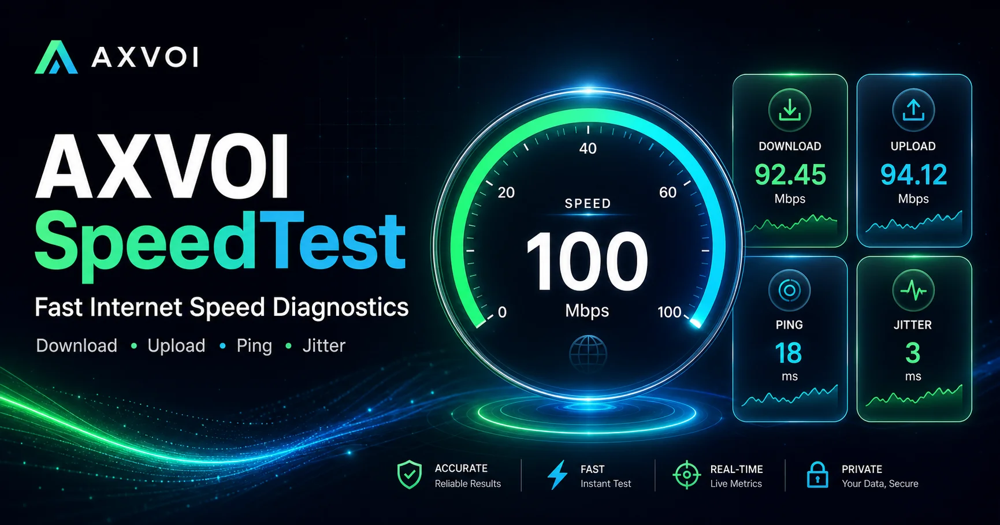

# AXVOI SpeedTest

AXVOI SpeedTest is a modern internet speed testing web app built with Next.js. It helps users test download speed, upload speed, ping, jitter, and connection status through a clean dashboard-style UI.


*(Note: If the preview image above does not render correctly, ensure an image exists at `./public/opengraph-image.webp` or replace it with your own.)*

## Features

- **Download Speed Test**: Measures how fast your connection receives data in real-time.
- **Upload Speed Test**: Measures how fast your connection sends data.
- **Ping & Jitter Test**: Checks latency and stability of your connection.
- **Animated Speed Dial**: Beautiful, high-performance gauge powered by Framer Motion.
- **Real-time Test Status**: Clear phases (Ready, Connecting, Download, Latency, Upload, Complete, Stopped).
- **Start / Stop Control**: Easy-to-use toggle to begin or cancel tests at any time.
- **Test Result Summary**: Simple assessment of your connection (e.g., "Excellent Connection" or "Needs Attention") upon test completion.
- **Local Test History**: Automatically saves your most recent tests locally in your browser.
- **Responsive UI**: A fully responsive layout with Header and Footer components tailored for any device.
- **Localhost Warning**: Detects and warns you if the backend test is running locally, which could skew real ISP speeds.
- **Google Analytics (GA4)**: Built-in support for pageview and event tracking using environment variables.

## Tech Stack

This project is built using modern web development tools:

- **Next.js**: React framework for production.
- **React**: Library for building user interfaces.
- **Tailwind CSS (v4)**: Utility-first CSS framework for rapid UI development.
- **Framer Motion**: Production-ready animation library for React.
- **Lucide React**: Beautiful & consistent icon toolkit.
- **LibreSpeed**: The core backend/frontend testing engine (`speedtest.js` & `speedtest_worker.js`).
- **Google Analytics 4**: Conditional loading via Next.js Script component.

## Folder Structure

A brief overview of the main files and folders in the project:

```text
├── public/
│   ├── opengraph-image.webp
│   ├── speedtest.js
│   └── speedtest_worker.js
└── src/
    ├── app/
    │   ├── api/
    │   ├── privacy/
    │   ├── terms/
    │   ├── globals.css
    │   ├── layout.jsx
    │   └── page.jsx
    └── components/
        ├── Footer.jsx
        ├── GoogleAnalytics.jsx
        ├── Header.jsx
        └── HeaderActions.jsx
```

## Getting Started

### Prerequisites

Ensure you have [Node.js](https://nodejs.org/) installed along with `npm`, `yarn`, or `pnpm` (the project currently uses `pnpm`).

### Installation

1. Clone or download the repository.
2. Install dependencies:

```bash
pnpm install
# or npm install / yarn install
```

### Environment Variables

If you wish to use Google Analytics, copy the example environment file or create a `.env.local` file:

```bash
cp env.example .env.local
```

Inside `.env.local`, set your GA Measurement ID:

```env
NEXT_PUBLIC_GA_MEASUREMENT_ID="G-XXXXXXXXXX"
```

### Running Locally

Start the development server:

```bash
pnpm dev
# or npm run dev / yarn dev
```

Open [http://localhost:3000](http://localhost:3000) in your browser to see the app.

*(Note: While running locally, you will see a localhost warning as the speed test will likely run against your local network rather than your real ISP.)*

## Customization

- **UI Elements**: Check `src/app/page.jsx` to adjust dial settings, test phases, and Framer Motion configurations.
- **Metadata**: Modify SEO and OpenGraph details directly in `src/app/layout.jsx`.
- **Global Styles**: Global CSS configurations and Tailwind directives are in `src/app/globals.css`.
